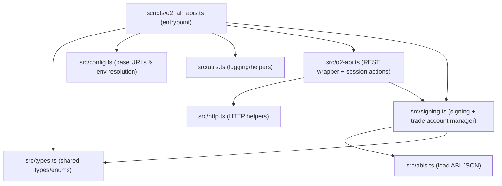

# O2 API Examples (REST + WS)

Single-script TypeScript example that exercises all documented O2 REST endpoints, plus a small WS docs file.

## Module Layout



## Quickstart

1. Install deps

```bash
pnpm install
```

2. Configure env

```bash
cp .env.example .env
# Set O2_OWNER_PRIVATE_KEY in .env
```

3. Run (read-only)

```bash
pnpm dev
```

4. Run with trading on mainnet (create order + cancel)

```bash
pnpm dev -- --execute-trades --confirm-mainnet
```

5. Allow account creation and destructive ops

```bash
pnpm dev -- --allow-destructive --confirm-mainnet
```

## What the Script Does

| Section | Endpoints | Requires |
|---------|-----------|----------|
| Market Data | `GET /v1/markets`, `/v1/markets/summary`, `/v1/markets/ticker` | — |
| Order Book Depth | `GET /v1/depth` | — |
| Trading Data | `GET /v1/trades`, `/v1/bars` | — |
| Aggregator | `GET /v1/aggregated/*` | — |
| Account & Balance | `GET /v1/accounts`, `POST /v1/accounts`, `GET /v1/balance` | `O2_OWNER_PRIVATE_KEY` |
| Session Creation | `PUT /v1/session` | `O2_OWNER_PRIVATE_KEY` |
| Trading (Create + Cancel) | `POST /v1/session/actions`, `GET /v1/orders` | `--execute-trades --confirm-mainnet` |
| Orders | `GET /v1/orders`, `GET /v1/order` | `O2_OWNER_PRIVATE_KEY` |

### Trading Flow

When `--execute-trades` is set, the script:

1. **Creates a session** — generates a session keypair, signs with the owner key, and registers via `PUT /v1/session`
2. **Places a buy order** — a low-price Spot buy order (5 USDC × 1.0 ETH) via `POST /v1/session/actions`
3. **Waits for propagation** — 3-second delay for on-chain state to settle
4. **Queries open orders** — fetches the order ID via `GET /v1/orders`
5. **Cancels the order** — submits a `CancelOrder` action via `POST /v1/session/actions`

## Testing the API Calls

### 1) Read‑only smoke test (no keys)

```bash
pnpm dev
```

Expected: market data, depth, trades, bars, and aggregated endpoints succeed; auth-only sections are skipped.

### 2) Authenticated but no trading

Set `O2_OWNER_PRIVATE_KEY` in `.env`, then run:

```bash
pnpm dev
```

Expected: account lookup and session creation run, but no orders are placed.

### 3) Full trading flow (create order + cancel)

```bash
pnpm dev -- --execute-trades --confirm-mainnet
```

Expected: a low-price order is placed on the selected market and immediately canceled.

### 4) Target specific markets

```bash
pnpm dev -- --markets 0xMARKET_ID_1,0xMARKET_ID_2
```

### 5) Use testnet

```bash
pnpm dev -- --network testnet
```

### Tips

- If `GET /v1/accounts` fails, use `--allow-destructive` to create a trade account.
- If you hit nonce errors, re-run; the script will sync nonce on failure.
- For aggregator endpoints, you can override the pair with `O2_MARKET_PAIR=BASE_QUOTE`.

## Safety Flags

| Flag | Effect |
|------|--------|
| `--execute-trades` | Places and cancels orders on the selected market |
| `--confirm-mainnet` | Required when trading on mainnet (safety gate) |
| `--allow-destructive` | Required to create a trade account or run `/withdraw`, `/upgrade`, `/call` endpoints |
| `--network testnet` | Run against testnet instead of mainnet |
| `--markets 0x...` | Override which market(s) to use |

## Docs

- WebSocket subscriptions: `docs/websocket.md`
- Session keys guide: [O2 Docs — Session Keys](https://docs.o2.app/api-endpoints/session-keys)
- Contract ABIs (vendored from `o2-exchange/contracts`): `abis/`
