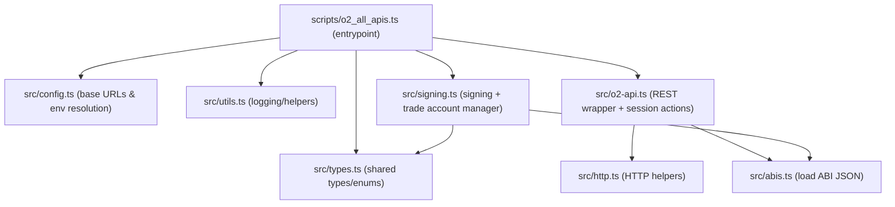

# O2 API Examples (REST + WS)

Single-script TypeScript example that exercises all documented O2 REST endpoints, plus a small WS docs file.

## Module Layout



## Quickstart

1. Install deps

```bash
pnpm install
```

2. Configure env

```bash
cp .env.example .env
```

3. Run (read-only)

```bash
pnpm dev
```

4. Run with trading on mainnet (tiny orders + cancel)

```bash
pnpm dev -- --execute-trades --confirm-mainnet
```

5. Allow account ops (withdraw/upgrade/call)

```bash
pnpm dev -- --allow-destructive --confirm-mainnet
```

## Testing the API Calls

### 1) Read‑only smoke test (no keys)

```bash
pnpm dev
```

Expected: market data, depth, trades, bars, and aggregated endpoints succeed; auth-only sections are skipped.

### 2) Authenticated but no trading

Set `O2_OWNER_PRIVATE_KEY` in `.env`, then run:

```bash
pnpm dev
```

Expected: account lookup/session creation attempts run, but no orders are placed.

### 3) Full trading flow (tiny orders + cancel)

```bash
pnpm dev -- --execute-trades --confirm-mainnet
```

Expected: tiny orders placed in two markets and immediately canceled.

### 4) Target specific markets

```bash
pnpm dev -- --markets 0xMARKET_ID_1,0xMARKET_ID_2
```

### 5) Use testnet

```bash
pnpm dev -- --network testnet
```

### Tips

- If `GET /v1/accounts` fails, use `--allow-destructive` to create a trade account.
- If you hit nonce errors, re-run; the script will sync nonce on failure.
- For aggregator endpoints, you can override the pair with `O2_MARKET_PAIR=BASE_QUOTE`.

## Safety Flags

- `--execute-trades` places and cancels tiny orders in two markets.
- `--confirm-mainnet` is required when trading on mainnet.
- `--allow-destructive` is required to run `/withdraw`, `/upgrade`, and `/call` endpoints.

## Docs

- WebSocket subscriptions: `docs/websocket.md`
- Contract ABIs (vendored from `o2-exchange/contracts`): `abis/`
